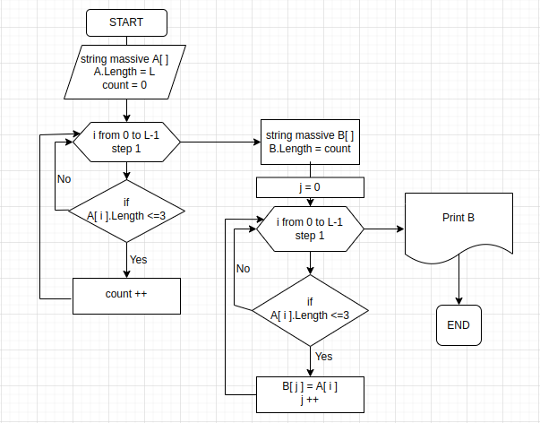

Код призван решать **Задачу*

## **Задача:*   
Написать программу, которая из имеющегося массива строк сформирует новый массив из строк, длина которых менее или равна 3 символов.

## *Блок-схема*

## **Решение:*

1. Первым в коде описан метод PrintArray, позволяющий распечатать любой строковый массив.

2. Задан первоначальный строковый массив А.
3. Введён счётчик count, и в цикле перебраны все элементы А. Каждый элемент,у довлетворяющий условию "длина не больше трёх символов", увеличивает count на единицу. Т.о., на выходе из цикла сщгте - число элементов А, удовлетворяющих условиюзадачи.
4. Создан новый массив В с количеством элементов, равным count.
5. И наконец, в новый массив В в цикле записываем поэлементно все строки из А с длиной не превышающей трёх символов.
6. С помощью метода PrintArray выводим В на печать.  

